# Restaurant Reservation Application 🍽️

A modern ASP.NET Core application for managing restaurant reservations, built with .NET 8.

## Features 🚀

- **User Management 👤**
  - User registration and authentication
  - Role-based authorization (Admin / Customer)
  - JWT Authentication & Profile management

- **Reservation System 📅**
  - Table booking for registered users
  - Guest reservations (without account)
  - Automatic reservation status updates (if it is outdated)
  - Table availability tracking

- **Admin Panel 🔧**
  - Manage reservations, menus, and tables
  - Update reservation status (e.g., Confirmed, Pending)
  - Clear, user-friendly dashboard views

- **Menu Management 🍕🍹**
  - Organize food & drink items
  - Categorize menus
  - Display dietary information, pricing, etc.

## Tech Stack 💻

- **Backend:**
  - ASP.NET Core 8 (Razor Pages)
  - Entity Framework Core 9
  - SQLite database
  - Identity Framework with JWT Bearer Authentication

- **Frontend:**
  - Razor Pages
  - Bootstrap 5 & Font Awesome
  - HTML5, CSS3, and JavaScript
 
## 📸 Screenshots

### 🏠 Home Page
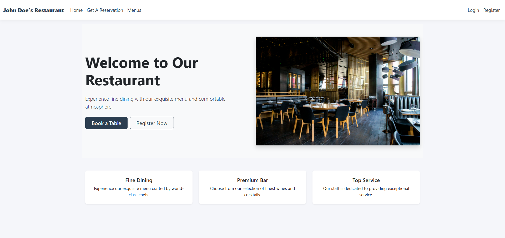

### 📅 Reservation Pages

This page is for guests.

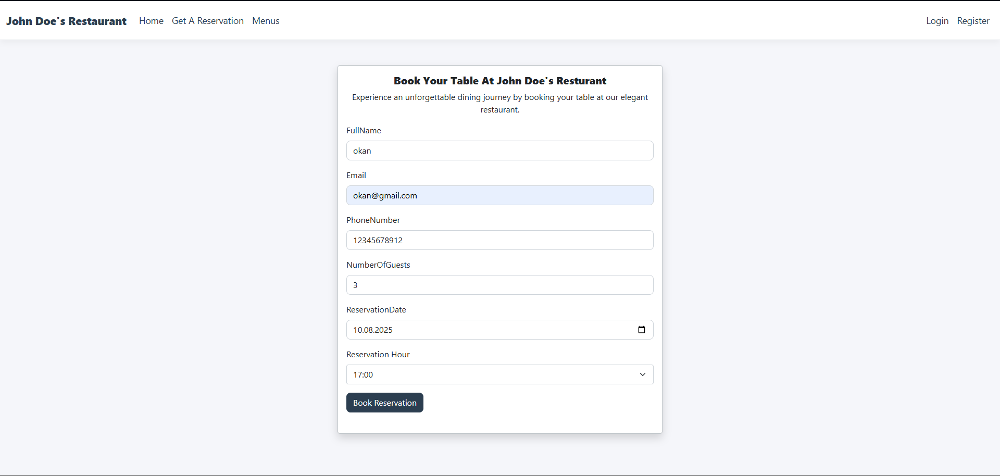

This page is for users.

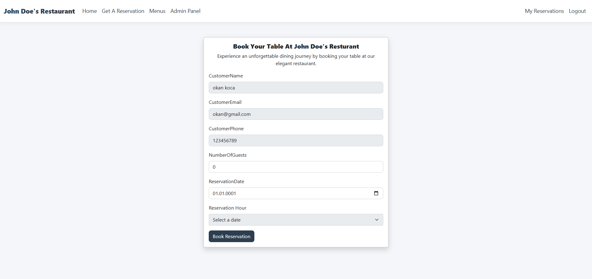

### 👤 User Dashboard
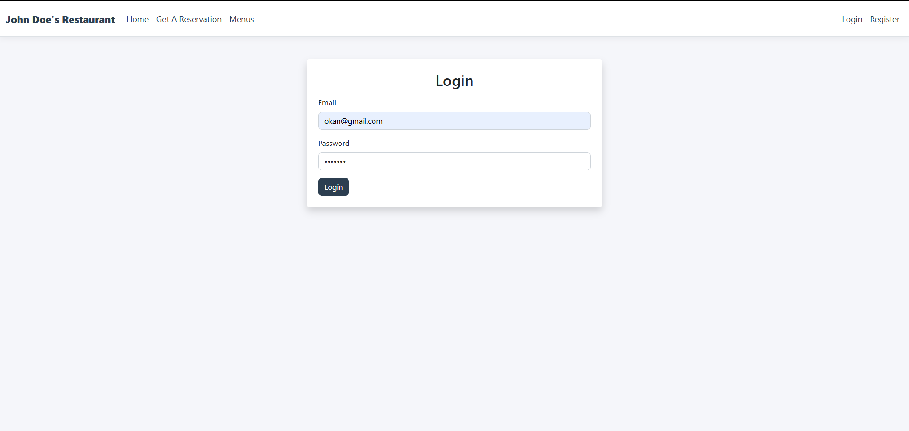

Here users can see their own reservations and cancel them.

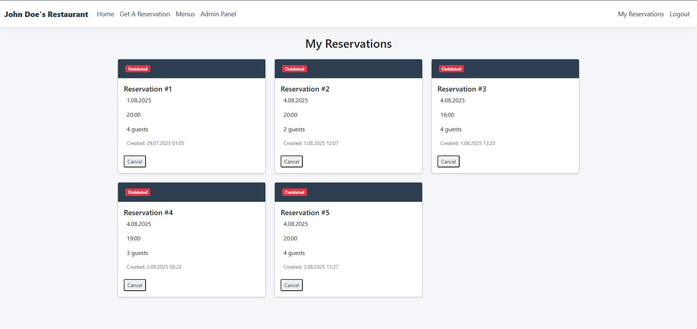

### 🍽️ Menus
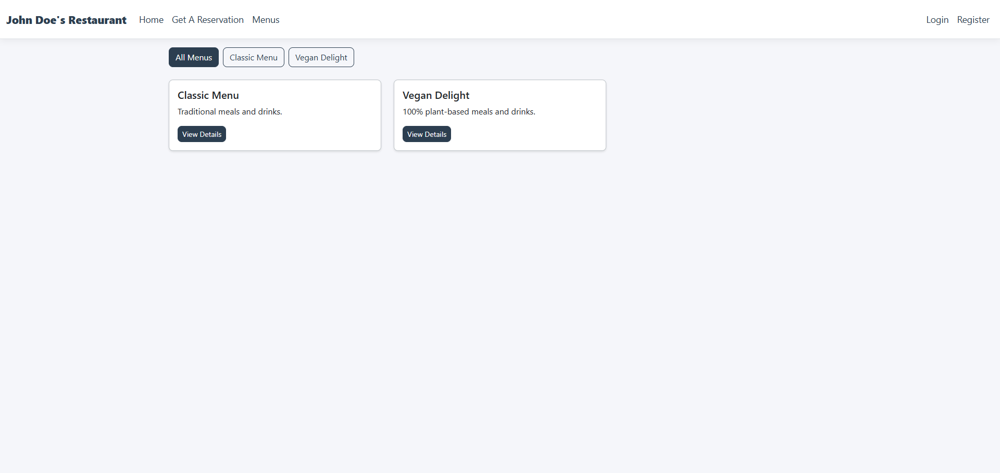
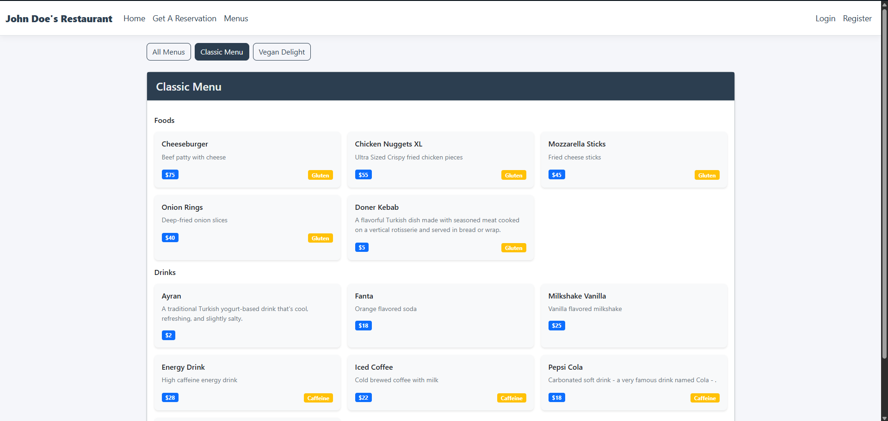

### 👤 Admin Dashboard
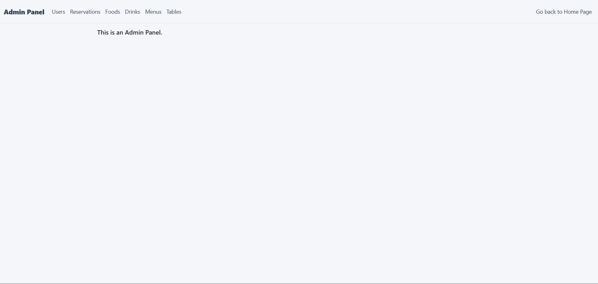

Admin can authorize a user or delete their account.

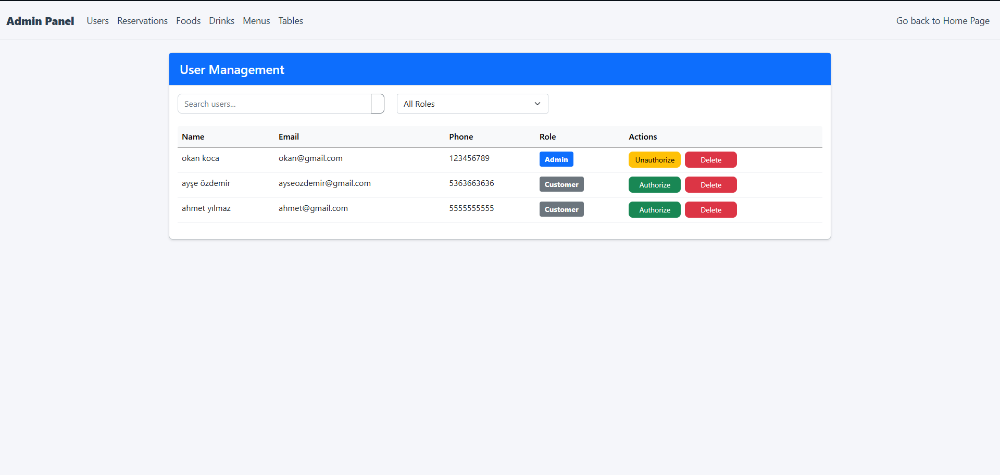

Admin can confirm a reservation and delete them.

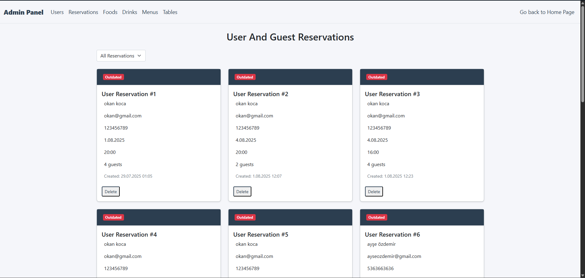

Admin can filter reservations to see only pending, outdated ones.

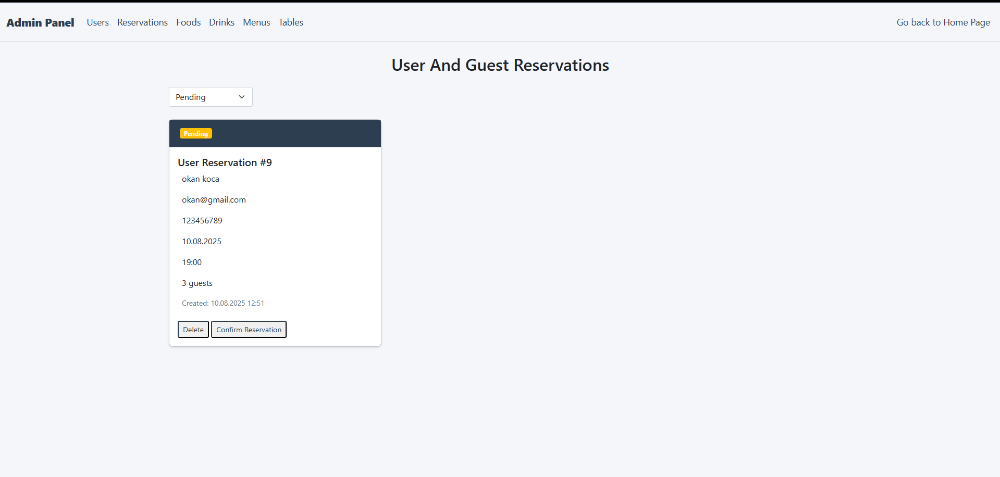
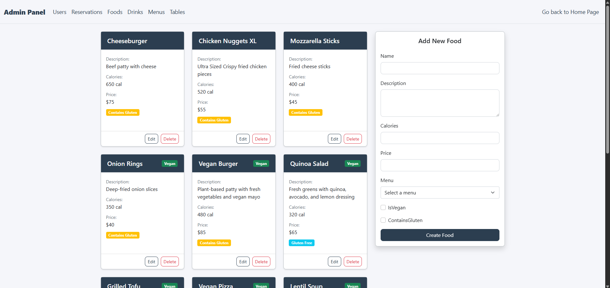
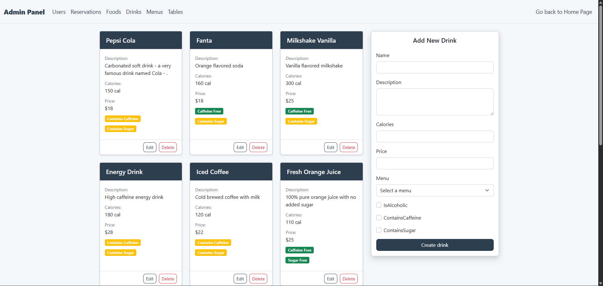
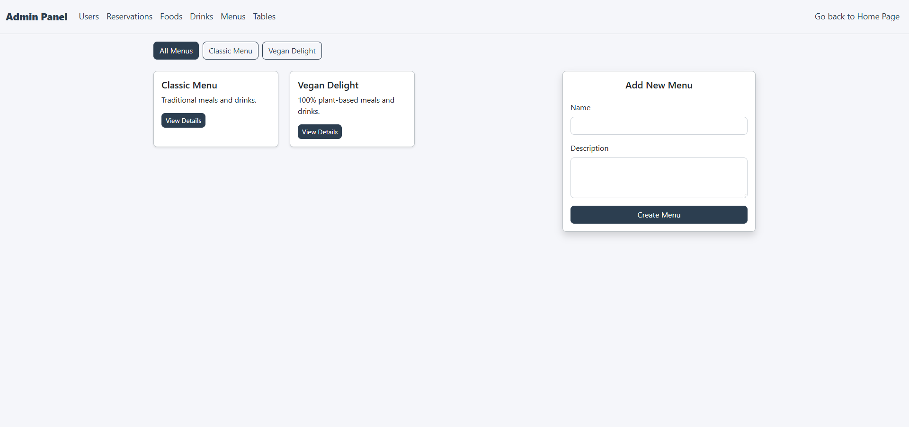

Admin can check a table's occupancy, reservations and add, delete table.

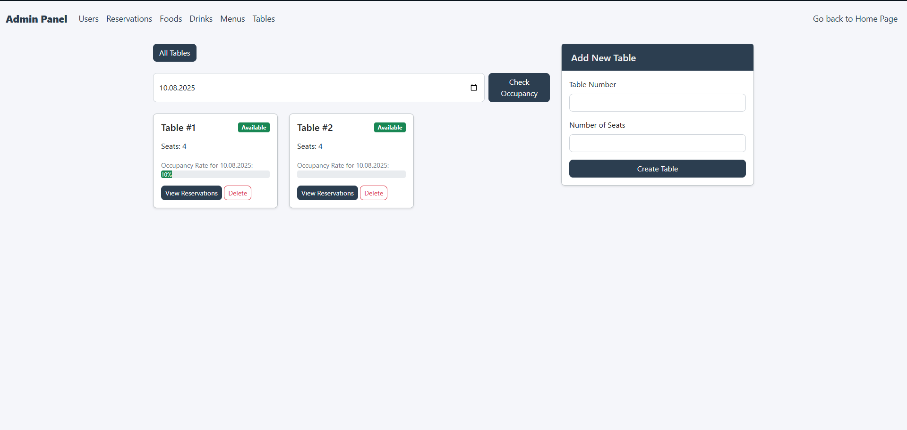

